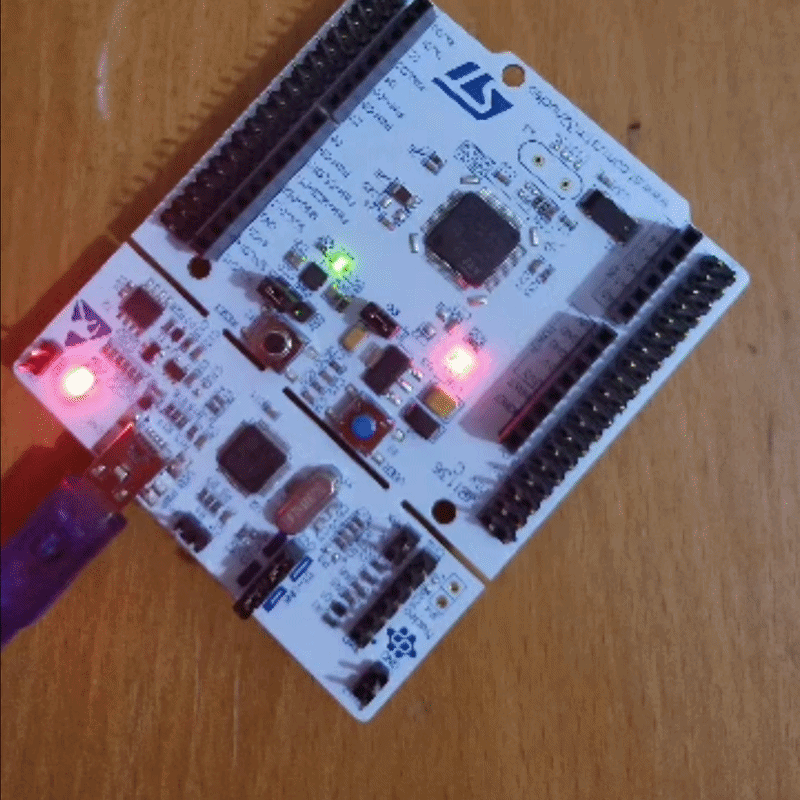

# 🛡️ STM32F446RE Hardware-in-the-Loop (HIL) Taktik Füze Savunma İstasyonu

Bu proje; kâğıt üzerindeki basit bir çizim ve fikirle yola çıkılarak, **STM32F446RE (ARM Cortex-M4)** mikrodenetleyicisi ile modern web teknolojilerini (**Web Serial API**) aracısız konuşturan bir **Hardware-in-the-Loop (HIL)** balistik fırlatma kontrol istasyonudur.

Tarayıcı ile mikrodenetleyici arasında Python, Node.js veya herhangi bir köprü yazılım olmadan, doğrudan USB sanal seri portu üzerinden çift yönlü haberleşme sağlanır.

---

## 🎯 Projenin Ortaya Çıkışı ve Geliştirme Süreci (Fikir & Yapay Zeka İş Birliği)

* **Fikir ve Tasarım:** Projenin mantığı, ızgara tabanlı hedef tespit sistemi, fırlatma rampası ve donanım register akış krokisi tamamen şahsım tarafından kâğıt üzerinde tasarlanmıştır.
* **Yapay Zeka (Google Gemini) Katkısı:** 
  * Fikir aşamasındaki çizimler, **Google Gemini** ile yapılan mimari beyin fırtınası sonucunda modern bir askeri HUD / Sci-Fi web arayüzüne (HTML5 Canvas, Glassmorphism, Web Audio API) dönüştürülmüştür.
  * STM32 tarafındaki HAL UART kesme (interrupt) mantığı, CubeMX register konfigürasyonları ve Web Serial API veri akış köprüsü Gemini desteğiyle optimize edilerek kodlanmıştır.
  * *Not: Bu açıklama, geliştirme sürecindeki şeffaflık amacıyla eklenmiştir; projenin donanım kurgusu ve entegrasyonu tamamen gerçek donanım üzerinde test edilerek doğrulanmıştır.*

---

## 🚀 Canlı Demo (GitHub Pages)

Projeyi gerçek bir STM32 kartı olmadan da dahili emülatör modu sayesinde doğrudan tarayıcı üzerinden deneyimleyebilirsiniz:  
👉 **[Taktik Savunma İstasyonunu Başlat](https://enveryasar90.github.io/STM32_Taktik_Radar_Istasyonu/)**  
*(Donanım bağlantısı için Chromium tabanlı Google Chrome, Microsoft Edge veya Opera önerilir).*

---
## ✅​ STM32 Mavi Tuş ile Atış ve Led Göstergesi
<p align="center">
  
</p>

## ⚡ Sistem Özellikleri ve Çalışma Mantığı

1. **Doğrudan Web-Donanım Entegrasyonu (Web Serial API):**
   * Tarayıcı, `navigator.serial` API'si üzerinden STM32'nin yerleşik ST-LINK Sanal COM Portuna (VCP) 115200 Baud hızında bağlanır.
2. **Radar Kilidi (Web -> STM32):**
   * Operatör radarda 6x6 ızgara üzerinde bir kareye tıkladığında balistik Azimuth, Elevation ve Menzil hesaplanır.
   * STM32'ye `LOCK:X,Y,AZIM,ELEV` paketi iletilir.
   * Kart üzerindeki **LD2 Yeşil LED (PA5)** donanımsal olarak yanarak kilitlenmeyi doğrular.
3. **Fiziksel Ateşleme Kesmesi (STM32 -> Web):**
   * Kartın üzerindeki **B1 Mavi Kullanıcı Butonuna (PC13)** basıldığında MCU, UART üzerinden `FIRE_BUTTON_PRESSED` sinyali basar.
   * Web arayüzü bu sinyali yakalayarak füzeyi rampadan çıkarır ve parabolik yörünge animasyonunu başlatır.
4. **Vuruş Doğrulaması (Hit Acknowledgment):**
   * Füze hedefe ulaşıp patladığında web istasyonu karta `HIT_CONFIRMED` komutunu gönderir.
   * STM32 bu komutu aldığında LD2 LED'ini 3 kez hızlıca yakıp söndürerek görevin tamamlandığını bildirir.
5. **Dahili Emülatör Modu (Standalone):**
   * Kart bağlı olmadığında sistem otomatik olarak sanal STM32 moduna geçer; register durumlarını (`TIM2`, `TIM3`, `GPIOC_ODR`) ekranda simüle eder.

---

## 🛠️ STM32F446RE Donanım ve Pin Yapılandırması

| Bileşen / Pin | İşlev | Mod / Katman | Açıklama |
|---|---|---|---|
| **PC13 (B1 Button)** | Ateşleme Tetikleyicisi | GPIO Input | Mavi buton ile donanımsal fırlatma sinyali üretir |
| **PA5 (LD2 LED)** | Kilit / Vuruş Bildirimi | GPIO Output | Hedef kilitlendiğinde yanar, hedef vurulduğunda flaş yapar |
| **PA2 (USART2_TX)** | Telemetri Çıkışı | AF7 (Asynchronous) | PC/Web arayüzüne log ve tetikleme mesajları yollar |
| **PA3 (USART2_RX)** | Komut Girişi | AF7 (Interrupt Modu) | Web'den gelen kilit ve koordinat paketlerini yakalar |

* **Baud Hızı:** 115200 bps
* **Format:** 8-N-1 (Parity Yok, 1 Stop Bit)
* **Kesme:** `USART2 global interrupt` devrede (`HAL_UART_RxCpltCallback`)

---

## 📁 Dosya ve Dizin Yapısı

```text
├── docs/                               <-- Web Arayüzü ve GitHub Pages Dosyaları
│   ├── index.html                      <-- Taktik HUD, Canvas ve Web Serial kodları
│   ├── launcher_truck.png              <-- Fırlatma aracı görseli
│   ├── target_vehicle.png              <-- Hedef zırhlı araç görseli
│   └── radar_map_bg.jpg                <-- Taktik uydu haritası dokusu
├── Firmware/                           <-- STM32CubeIDE Proje Dosyaları
│   ├── Missile_Guidance_Station.ioc    <-- CubeMX pin ve saat konfigürasyonu
│   ├── main.c                          <-- Ana döngü, UART ayrıştırıcı ve buton okuma
│   ├── main.h                          <-- Pin ve kütüphane tanımları
│   ├── stm32f4xx_it.c / .h             <-- Donanımsal kesme vektörleri
│   └── stm32f4xx_hal_msp.c             <-- Düşük seviye donanım başlatma
└── README.md                           <-- Proje dokümantasyonu
